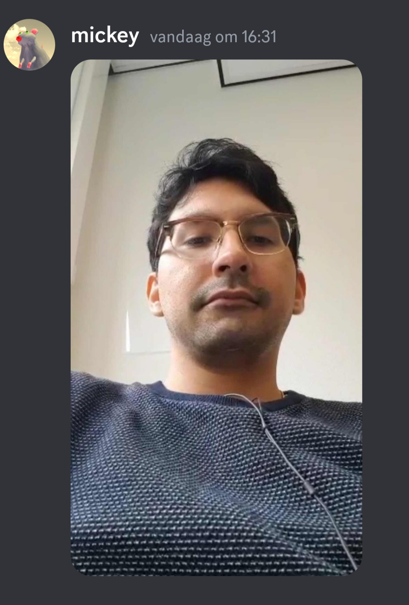

# reflectie-opdracht

## Christian Haan

#### Wat heb ik met deze lessen geleerd?
  ik heb met deze lezzen geleerd wat git is en hoe je de basis van git gebreukt en de belangrijkste commands zoals: git log, git push, git pull, git add enzovoort. Ook heb ik geleerd hoe je met een collega/mede student samen kan werken in      het zelfde document maar op verschillende delen evan zodat je de hoofd code niet verprutst als je expirementeerd met je code of nieuwe dingen probeert.

#### Wat wist ik al?
  toen we met git begonnen wist ik er nog helemaal niks van ook niet dat het bestond of wat het allemaal kan doen en waarvoor je het kan gebruiken.

#### Waarvan zou ik nog meer willen leren?
  ik zou graag nog meer leren over git wat je ermee kan en wat niet. ook ozu ik graag beter willen worden in de git commands en ze meer uit me hoofd leren.

=======
# GIT Reflectie Opdracht M1SKIL

## Julian Kreike

1. Wat heb ik met deze lessen geleerd?
**Antwoord:** Ik heb geleerd om te kunnen werken met git waaronder: git add,git commit,git pull,git push,git merge en met branches kunnen werken.
1. Wat wist ik al?
**Antwoord:** Helemaal niks ik wist niks over hoe je met git moest werken maar nu heb ik dat wel geleerd.
1. Waarvan zou ik nog meer willen leren?
**Antwoord:** Eiglijk vind ik wat ik nu geleerd heb genoeg maar als er nog meer is om te leren zou ik het best willen leren.

# Arturo

#### Wat heb ik deze lessen nieuw geleerd?

Hoe je met github kan werken. Het allereerste hoe je branches maakt, en wat de main is. Hoe je via branches kan navigeren en push, pullen en commiten.
Markdown in de README.md bewerken en opslaan.

#### Wat wist ik al?

Waarvoor je github gebruikt in het bedrijfsleven. 

#### Waarvan zou ik nog meer willen weten?

Meer commando's die in het bedrijfleven belangrijk kunnen zijn. En al het werk makkelijk voor mij maken.